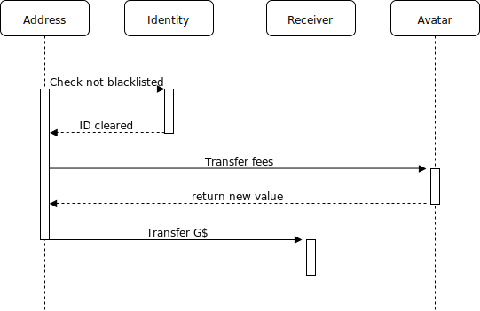
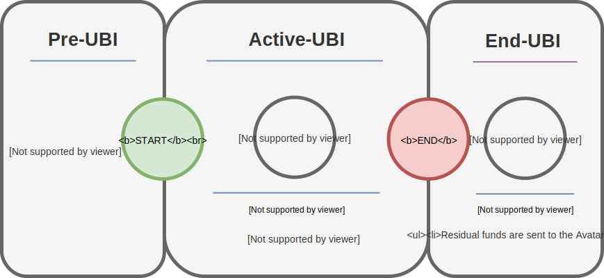
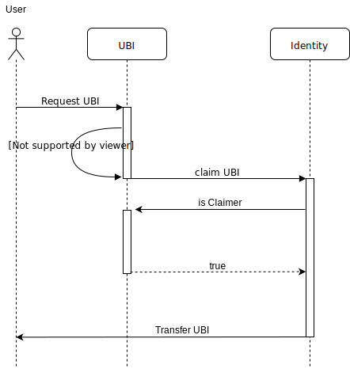

# [GoodDollar](https://gooddollar.org) - GoodContracts
[](https://circleci.com/gh/gooddollar/goodcontracts)
[](https://coveralls.io/github/gooddollar/GoodContracts?branch=master)
[](https://opensource.org/licenses/MIT)
[](https://gitter.im/GoodDollar/community?utm_source=badge&utm_medium=badge&utm_campaign=pr-badge)
# Contributing

Welcome to the GoodDollar repository! 

Everyone is welcome: Developers, designers, and entrepreneurs with a passion for decentralized technologies and a vision to build a new world that has equality, security, inclusivity, and innovation as its cornerstones.
Refer to [GoodDocs](https://docs.gooddollar.org/contributing) for further information.

# Try GoodDollar

## Installation
Clone the repository:

```shell
git clone https://github.com/GoodDollar/GoodContracts.git
```

Install packages:

```shell
npm install
```
## Usage
To test the library and setup the environment, issue the following command:
```shell
  npm run test
```
## Setup GoodDollar

1. Go to the GoodContracts repository:

```shell
cd GoodContracts
```
2. Create a ```.env``` file:

```shell
cp .env.example .env
```

3. Fill in the required information. see [Configuration](./docs/Configuration.md) for descriptions.

## Deploy GoodDollar

The GoodContracts DAO can be deployed in two ways:

``` full ``` - All contracts are deployed to the network given in ``` .env ```. This is done by running ``` npm run deploy:full ```

``` light ``` - The DAO contracts and GoodDollar is deployed. OneTimePayments, UBI and SignUpBonus are not. This is done by running ``` npm run deploy ```

## Deploy UBI

New UBI schemes are deployed by calling 
```shell
npm run deploy:ubi
```
This will deploy a UBI contract with the parameters given in [the migration script](./migrations/3_deploy_new_ubi.js), propose it as a new scheme vote for it and start the contract if enough votes are given. 

## Deploy SignUpBonus

New SignUpBonus schemes are deployed by calling 
```shell
npm run deploy:signup
```
This will deploy a SignUpBonus contract with the parameters given in [the migration script](./migrations/4_deploy_new_signup.js), propose it as a new scheme vote for it and start the contract if enough votes are given.

## Deploy OneTimePayment

New OneTimePayments schemes are deployed by calling 
```shell
npm run deploy:otp
```
This will deploy a OneTimePayment contract with the parameters given in [the migration script](./migrations/5_deploy_new_otp.js), propose it as a new scheme vote for it and start the contract if enough votes are given.

### Prerequisites
You need to have [`node`](https://nodejs.org/) installed.
This repository has only been tested on UNIX-derived systems.

## Files
Path | Description
------------- | -------------
`contracts/` | All the solidity files making up the implementation
`contracts/token` | Contains the GoodDollar implementation
`contracts/token/ERC677` | ERC677 implementation
`contracts/identity` | Defines the identity implementation, i.e. adding claimers and blacklisting
`contracts/dao` | Contains the daocreator for creating DAOs
`contracts/dao/schemes` | Contains different schemes that can be deployed, registered and used within the DAO 
`contracts/mocks` | Contracts used specifically for testing purposes
`test/`  | Contains testing code
`scripts/` | Specific scripts for testing and coverage

# Learn about GoodDollar

The [GoodDollar](https://www.gooddollar.org/#what-is-GoodDollar) mission is reducing wealth inquality by building a new, global, open-source cryptocurrency for distributing money according to the principles of universal basic income (UBI).

To learn more about the reasoning behind the GoodDollar Experiment, please read the [Position Paper](https://www.gooddollar.org/wp-content/uploads/2018/11/GD-Wealth-Distribution-Position-Paper.pdf).

This implementation of the GoodDollar contract system contains forked and modified from the DAOstack repo. We recommend anyone interested in learning about DAOs to [read and contribute] https://github.com/daostack

In this document, we present the on going development efforts and specification of the extended design of the GoodDollar contract system. In section one, we introduce the key concepts of the contract system. In section two, we introduce the individual contracts available in this repo. 

This text introduces the core components of the GoodDollar contract system and is intended as a brief overview of the current status of development. This specification is subject to ongoing development and frequent review. This text may not reflect the most recent commit.

## GoodDollar Design Overview

In the Table presented below, we provide an overview of the extended design of the GoodDollar contract system suggested for this specification.


*__Figure 1:__ Design overview of the GoodContracts system*

# GoodDollar Contract System: The Key Concepts 

The GoodDollar contract system is an implementation of a decentralized autonomous organization. The design presented in this document is an iterative policy framework through which users can engage in the collective decision making on the allocation and inflation schedule of a new asset-class: The GoodDollar.  

Users suggest, advocate and vote for policy proposals in the form of 'schemes'. A scheme is a user-defined script, containing the logic by which the distribution of community funds is executed at specified intervals.  

Once implemented, a scheme will run for a given period of time and subsequently deprecate, at which point the community will vote on either extending or replacing the extant scheme.  

Voting power is defined by 'reputation points', a value assigned to all registered addresses. Reputation points can be distributed by any arbitrary logic and perform any arbitrary decision making function in the system. In this implementation, reputation points denote a weighted distribution in which one reputation point equals one vote in a binary choice evaluated by the absolute majority criterion.  

The voting logic itself is *also* implemented as a scheme and is, just as the distribution policy, subject to change by a absolute majority voting.  

This concept facilitates the abstract notion of decentralized decision-making in distributed systems of autonomous agents, as the contract system assimilates the political decision-making process through which fiscal policy is implemented in conventional parlimentary systems. Nevertheless, here _all_ participants can attain voting power by virtue of their participation and engagement with the system.  

In the following months, we will present more cohesive work on the topic of voting power and decentralized decision-making in decentralized systems. Please stay in touch by following this repo or keep an eye out on social media. 

The contract system for the current release, comprises four main components:  

## Implementation of a Decentralized Autonomous UBI system (The DAU)

The DAU is a decentralized decision-making and resource distribution mechanism. It contains four elements: 

* Schemes -  A "scheme" is a 'wrapper' enacting a given policy or functionality in the GoodDollar contract system. Schemes are deployed by users and elected by the DAU contract through 'reputation voting' (see below). The UBI distribution policy, the one-time payment link policy, the sign-up bonus policy, and the identity contract are all implemented as 'schemes' and can be reiterated and redeployed by the GoodDollar community. 

* Reputation points - Reputation points are awarded to user accounts by the DAU. The reputation distribution function will be based on contributions to the system, as defined by the GoodDollar community. Reputation is non-transferable and (re)distributed by the DAU. 

* Voting Mechanism - Schemes are approved or rejected through voting. Rules can be implemented for any arbritary voting process and logic. In this initial implementation, voting follows the standard absolute majority criterion. In this implementation, a single reputation point will denote a single vote in the scheme selection process.

* Global Constraints - Global constraints are limitations the DAUs actions. When executing a scheme, the controller component checks the constraints to see if a given action violates them, and blocks the execution if it does. 

## Representation of Value with an ERC20 Token (The GoodDollar)
The GoodDollar is a mintable, burnable and ERC20 compatible token. The GoodDollar token can collect an adjustable fee stored in a reserve, whenever a transaction is made.

## Achieving Tranaction speed with a Bridge Contract and Sidechain
The bridge contract is an interoperability protocol that allows users to easily and safely transfer digital assets between two blockchains. Similar to an atomic swap operation, assets are locked in one network while representative assets are minted in the other one, and when the process is reversed the representative assets are burned and the locked assets released. The GoodDollar system is currently implemented on a sidechain connected through the Bridge Contract. For this implementation, we deploy on the fuse network: https://github.com/ColuLocalNetwork/fuse-network

# Contract Overview

In the Table presented below, we provide a simple overview of the GoodDollar contract and scheme taxonomy. Only the most fundemental schemes are included in the list below.

name | Description 
---- | ----------------
`GoodDollar` | ERC20 Token that collects fees in every transfer. Native token of the system
`DaoCreator` | Creates a single GoodDollar organization with an array of founders able to vote for schemes.
`Controller` | The central entity of the DAO which connects the Avatar and gives permission to the other contracts.
`Avatar` | A contract that receives the fee, stores it and communicates with the outer world
`UBI` | The Universal Basic Income calculating and processing contract scheme.
`SignUpBonus`| The sign-up bonus handling contract.
`OneTimePayments` | The one-time payment contract.
`Identity` | The contract defines who is eligible to claim the tokens and counts the total number of people who signed up for it.

### GoodDollar

The GoodDollar token is a mintable, burnable and ERC20 compatible token. In this implementation, the token collects an adjustable fee. 

Below we list the three main functions, adopted from the standard contract:

name | Description | Working Priciple
| ------------- | ------------- | ------------- |
`transfer(to, value) / transferFrom(from, to, value)` | Gives the system the ability to collect fees. | Whenever transfer or transferFrom is called with a given value, processFees is called with said value, transferring the transactional fees (set by the DAO at any given time, by a specific scheme) to the feeRecipient and returning the new value to be transferred along.
`approve(spender, value)` | Gives a delegate the right to spend a certain amount of tokens of a delegator. The delegators retain the ownership of the tokens until they are spent. | no peculiarities
`balanceOf(user)` | It allows the system to know the G$ balance of a specific address. | no peculiarities 

Below, we display the GoodDollar transfer function sequence diagram, highlighting the details of the process.



*__Figure 2:__ Transfer function. Checks identity, then sends fees to avatar, which returns the new transfer value and sends it to the receiver.*

### DAUCreator

The DAUCreator contract is responsible for creating the DAU in a single transaction. When creating a DAU, a Token (The GoodDollar token) and reputation are created, which are then used to create the avatar. The founders specified in the creation are then granted their respective tokens and reputation. The controller is then created and given ownership of the GoodDollar, Reputation and Avatar. The caller of the dao creation transaction is then allowed to register an array of initial schemes.

### Controller
The Controller is the 'owner' of the DAO. It gives permission to other schemes, enforces adherence to global constraints, regulate the reputation points and most importantly it connects to the Avatar.

### Avatar
The Avatar is the outer facing part of the DAO system, which interacts with the other  DAOs and contracts. The three main functions of the Avatar are to:

* Communicate with other contracts
* Receive the transaction fees 
* Store the fees and also other tokens (i.e., Ether)

### Schemes

A UBI scheme can be created by anyone and submitted to the GoodDollar Community. A UBI scheme is proposed and voted upon by users. Once a UBI scheme is implemented, the Controller transfers the alotted amounts from the reserves.

When the UBI scheme is created, the author defines start and end periods. A bool, isActive, is set to false, making the policy ‘dormant’ until start() is called. Once start() is called the UBI is active and the claiming process begins. 

The Reserve (Avatar) sends all its funds to the UBI contract, and the GoodDollar to mint, indicated in the constructor, is minted to and sent to the contract.



*__Figure 3:__ The three states the UBI contract moves through*

Then, the distribution ratio is calculated and isActive is set to true, allowing users registered as claimers (before the start period) to claim UBI. After a successfull claim is registered, the users claimin status is updated in order to prevent multiple claims from the same address. 



*__Figure 4:__ UBI claiming sequence diagram*

Finally, the end() function is called, terminating the contract. This can only be done after the period has been exceeded. A deprecated scheme transfers all remaining funds back to the reserve.


## Supporting Contracts

A number of contracts are implemented to support the launch of the GoodDollar system. These contracts are implemented as 'schemes' and are subject to reputation voting by the community. 

### Sign-up bonus

The sign-up bonus scheme allows administrators to award tokens up to a given maximum to users for inviting others.

### OneTimePayments

The OneTimePayments scheme is able to receive funds and keep them stored under a hashed code, allowing users to send funds to unregistered users that can be claimed once they have been registered.

### Identity

The Identity scheme manages the list of verified user addresses and blacklisted addresses.

## Community
Below you can find a comprehensive list of useful links.
* Check out our [community](https://community.gooddollar.org/) website
* Check out our [Blog](https://medium.com/gooddollar)
* Join the Gooddollar Alpha by signing up [here](https://community.gooddollar.org/alpha/) and validating your identity
* Contribute to the code on our [GitHub](https://github.com/gooddollar)
* Join our community forum [here](https://forum.gooddollar.org/)
* Become an ambassador [here](https://community.gooddollar.org/ambassadors/)
* Request a sponsorship [here](https://community.gooddollar.org/sponsorships/)
* Follow us on [Twitter](https://twitter.com/TheGoodDollar)
* Join our [Telegram](http://t.me/GoodDollarX) group
* Like and subscribe on [Facebook](https://www.facebook.com/TheGoodDollar)
* Check out our [YouTube](https://www.youtube.com/channel/UC_8oVeHIUo9U8gAc2BwaviA/videos) video channel
* Subscribe to our [Medium](https://medium.com/@gooddollar) blog
* View our [terms and conditions](https://community.gooddollar.org/terms/)
