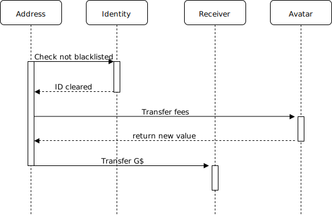
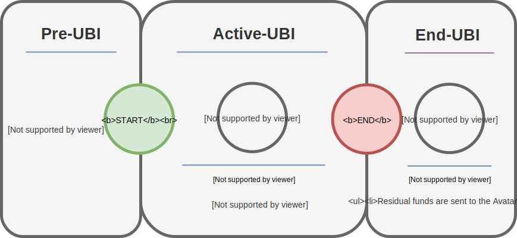
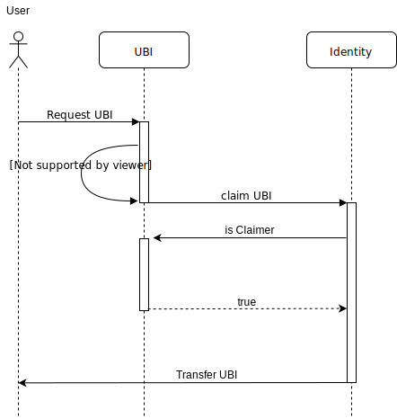

# Learn about GoodDollar
Welcome to the GoodDollar repository! The [GoodDollar](https://www.gooddollar.org/#what-is-GoodDollar) mission is to build a new, global, open-source cryptocurrency – called GoodDollar – to distribute money using the principles of universal basic income (UBI), reducing wealth inequality. To learn more about the political position of the GoodDollar Experiment read the [Position Paper](https://www.gooddollar.org/wp-content/uploads/2018/11/GD-Wealth-Distribution-Position-Paper.pdf).

In this document, we present the on going development efforts and specification of the extended design of the GoodDollar contract system.

This text introduces the core components of the GoodDollar contract system and is intended as a brief overview of the current status of development. This specification is subject to ongoing development and frequent review. This text may not reflect the most recent commit.

## GoodDollar Design Overview

In the Table presented below, we provide an overview of the extended design of the GoodDollar contract system suggested for this specification.

*__Figure 1:__ Design overview of the GoodContracts system*

# GoodDollar Contract System: Key Concepts

The GoodDollar contract system is a decentralized autonomous organization, consisting of four main components:

## Token
The GoodDollar is a mintable, burnable and ERC20 compatible token. The GoodDollar token can collect an adjustable fee stored in a reserve, whenever a transaction is made.

## DAU
The DAU is a decentralized decision-making and ressource distribution mechanism. It contains four elements: 

* Schemes -   A "scheme" is a 'wrapper' enacting a given policy or functionality in the GoodDollar contract system. Schemes are deployed by users and elected by the DAU contract through 'reputation voting' (see below). The UBI distribution policy, the one-time payment link policy, the sign-up bonus policy, and the identity contract are all currently implemented as 'schemes' and can be reiterated and redployed by the GoodDollar community. 

* Voting Mechanism - Proposals are approved or rejected through voting. Rules can be implemented for any voting process, from a simple vote to an absolute vote where 51% of voting power is required for approval.

* Reputation points - Reputation points are awarded to user accounts by the DAU, based on their contribution to the system, as defined by the GoodDollar community. The balance of reputation points represents the influence each participant will hold in a given voting policy elected by the DAU. Reputation is non-transferable and (re)distributed by the DAU.

* Global Constraints - Global constraints are limitations the DAUs actions. When executing a scheme, the controller component checks the constraints to see if a given action violates them, and blocks the execution if it does. Some examples of constraints might be: the token supply can't be increased over 1M tokens, the organization won't use more than 60% of its funds at once, etc

## Bridge Contract
The bridge is an interoperability protocol that allows users to easily and safely transfer digital assets (coins, tokens) between different blockchain in the Ethereum ecosystem. In order for chains to interoperate, the assets are locked in one network while representative assets are minted in the other one, and when the process is reversed the representative assets are burned and the locked assets released.

## Sidechain
The GoodDollar system is currently implemented on a sidechain connected through the Bridge Contract. A sidechain is a blockchain that is independent and runs in parallel to the main net while being linked to it in a two-way connection. The main functionality provided by this solution is to perform an interchain transfer of tokens.

## Key Contract Taxonomy

In the Table presented below, we provide a simple overview of the GoodDollar contract and scheme taxonomy. Only the most fundemental schemes are included in the list below.

name | Description 
---- | ----------------
`GoodDollar` | ERC20 Token that collects fees in every transfer. Native token of the system
`DaoCreator` | Creates a single GoodDollar organization with an array of founders able to vote for schemes.
`Controller` | The central entity of the DAO which connects the Avatar and gives permission to the other contracts.
`Avatar` | A contract that receives the fee, stores it and communicates with the outer world
`UBI` | The Universal Basic Income calculating and processing contract scheme.
`SignUpBonus`| The sign-up bonus handling contract.
`OneTimePayments` | The one-time payment contract.
`Identity` | The contract defines who is eligible to claim the tokens and counts the total number of people who signed up for it.

### Token

The GoodDollar token is a mintable, burnable and ERC20 compatible token. What makes it different from other ERC20 tokens is that whenever a transfer is made it will collect some fees that will be stored in a reserve. 

Below are three main functions, that have been adopted from the standard contract:
name | Description | Working Priciple
| ------------- | ------------- | ------------- |
`transfer(to, value) / transferFrom(from, to, value)` | Gives the system the ability to collect fees. | Whenever transfer or transferFrom is called with a given value, processFees is called with said value, transferring the transactional fees (set by the DAO at any given time, by a specific scheme) to the feeRecipient and returning the new value to be transferred along.
`approve(spender, value)` | Gives a delegate the right to spend a certain amount of tokens of a delegator. The delegators retain the ownership of the tokens until they are spent. | no peculiarities
`balanceOf(user)` | It allows the system to know the G$ balance of a specific address. | no peculiarities 

Below, we display the GoodDollar transfer function sequence diagram, highlighting the details of the process.

*__Figure 2:__ Transfer function. Checks identity, then sends fees to avatar, which returns the new transfer value and sends it to the receiver.*

### DAU

Below, the most important elements of the DAU are introduced.

#### DaoCreator

The DaoCreator contract is responsible for creating the DAO in a single transaction. When creating a DAO, a Token(The GoodDollar token) and reputation are created, which are then used to create the avatar. The founders specified in the creation are then granted their respective tokens and reputation. The controller is then created and given ownership of the GoodDollar, Reputation and Avatar. The caller of the dao creation transaction is then allowed to register an array of initial schemes.

#### Controller
The Controller is the 'owner' of the DAO. It gives permission to other schemes, enforce adherence to global constraints, regulate the reputation points and most importantly it connects to the Avatar.

#### Avatar
The Avatar is the outer facing part of the DAO system, which interacts with the other  DAOs and contracts. The three main functions of the Avatar are to:

* Communicate with other contracts
* Receive the transaction fees 
* Store the fees and also other tokens (i.e., Ether)

#### UBI

A UBI scheme can be created by anyone and submitted to GoodDollar Community. A UBI scheme is proposed and voted upon by users. Once a UBI scheme is implemented, the Controller transfers the alotted amounts from the reserves.

When the UBI scheme is created, the author defines start and end periods. A bool, isActive, is set to false, making the policy ‘dormant’ until start() is called. Once start() is called the UBI is active and the claiming process begins. 

The Reserve (Avatar) sends all its funds to the UBI contract, and the GoodDollar to mint, indicated in the constructor, is minted to and sent to the contract.

*__Figure 3:__ The three states the UBI contract moves through*

Then, the distribution ratio is calculated and isActive is set to true, allowing users registered as claimers (before the start period) to claim UBI. After a successfull claim is registered, the users claimin status is updated in order to prevent multiple claims from the same address. 

*__Figure 4:__ UBI claiming sequence diagram*

Finally, the end() function is called, terminating the contract. This can only be done after the period has been exceeded. A deprecated scheme transfers all remaining funds back to the reserve.

### Supporting Contracts

A number of contracts are implemented to support the launch of the GoodDollar system. These contracts are implemented as 'schemes' and are subject to reputation voting by the community. 

#### Sign-up bonus

The sign-up bonus scheme allocates an initial amount of GoodDollar to new users. 

#### OneTimePayments

The OneTimePayments scheme allocates GoodDollar to new addresses. The private key or mnemonic phrase associated with the address will be send to a new email.

#### Identity

The Identity scheme manages the list of verified user addresses and blacklisted addresses.

